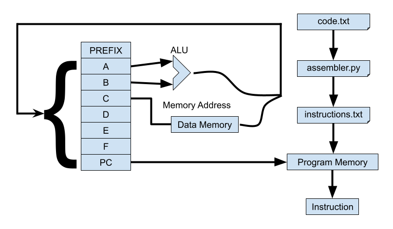
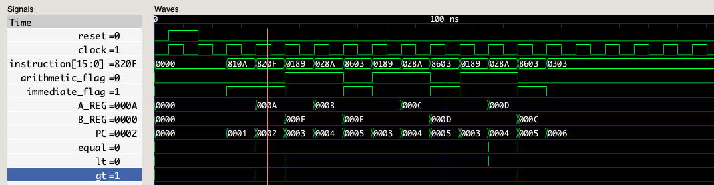
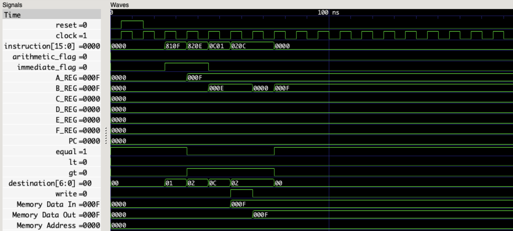

# Processor

This is a simple processor written in VHDL. Every instruction is 16 bits wide and executes in a single clock cycle. This was developed for educational purposes only. My goal was to learn some VHDL and basic processor design. This was a weekend project and many improvements can be made in the future.

The tools used were 
* GHDL 2.0
* GTKWave 3.3.107
* Python 3

## How does it work?

The processor I developed has seven registers for holding data and one register to act as the program counter. Registers a and b are special in that they are the inputs to arithmetic operations. The last register is always the program counter. The first register is always used as a prefix register for loading the high 8 bits of a constant when registers are set to values greater than 255. 

The instructions provided by instructions.txt are loaded into program memory and executed. 256 16-bit instructions are expected in hexadecimal by the processor. 



## Instruction Format
```
iddd dddd asss ssss
```
```
i - immediate flag (1 = true, 0  = false)
d - destination register address
a - arithmetic flag (1 = true, 0  = false)
s - source register address (or raw value if immediate flag set)
```

Example instructions (without no operation padding):
```
Add a and b write to a
1000 0001 0000 1111 -> (set a to 15)
1000 0010 0000 0111 -> (set b to 7)
0000 0001 1000 0001 -> (a = a + b)


810F
8207
0181
```
```
Jump to pc = 1 if a > b (loop)
1000 0001 0000 1111 -> (set a to 15)
1000 0010 0000 0111 -> (set b to 7)
1000 1011 0000 0001 -> (set pc 1 if a > b)

810F
8207
8B01
```
```
Increment b by one
1000 0010 0000 0111 -> (set b to 7)
0000 0010 1000 1001 -> (increment b)

8207
0289
```

Instructions can be written to instructions.txt manually, or more easily through assembler.py. It generates instructions from the code written in code.txt and pads instructions.txt with no operations.

Example input for assembler.py
```
#Repeatedly increment a and decrement b until a >= b
set a 10
set b 15
label loop
inc a
dec b
set pc loop if lt
copy pc to pc
```

The shell script run.sh runs all commands necessary to produce a .ghw from assembler code which can then be opened with GTKWave to confirm the results of the instructions.



## Operations supported
* add/subtract integers
* logical and, or, xor
* comparisons (>, =, , !=, <)
* copy data from one register to another
* jump conditionally or unconditionally
* set registers to immediate value
* increment register by 1
* decrement register by 1
* shift left/right one bit

## Known Issues
Writing and then immediately reading the same memory location will result in a data hazard. The latest value will not be obtained because the stored memory is delayed by one cycle. There is never a reason to do this instead of directly copying registers to registers. However, adding a nop will avoid the data hazard.

```
set a 15
set b 14
copy a to memory
copy memory to b
copy memory to b
```

